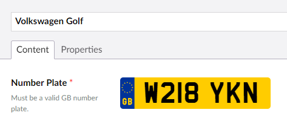

# UK Number Plate Editor
Umbraco property editor for UK number plates.

## Features ##

* Input styled as number plate
* Validation for [all current number plate formats](http://dvlaregistrations.direct.gov.uk/help/website-usage.html?question=style_reg)

## Install ##

1. Drag `UKNumberPlateEditor` folder to `App_Plugins`
2. Restart Umbraco
3. Create a new datatype, "UK Number Plate Editor" will appear in the dropdown list
